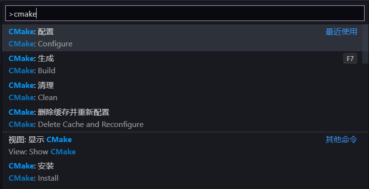

# 开始使用

CoolQ C++ SDK 使用 CMake 作为构建管理工具，使用现代 C++ 作为开发语言。对于这两者的新手来说，建议阅读本页的入门版开始教程，跳过高级版；而如果你是老手，可以直接跳到高级版开始教程。

:::tip 提示
无论什么操作系统都可以运行开始教程，如果你正在使用 Linux 或 macOS，不用担心，可以先用你最熟悉的系统进行体验，之后再转而使用 Windows 开发或使用 AppVeyor CI 等构建 DLL。
:::

## 准备

### CMake

如果你的系统中还没有安装 CMake，请先前往 [官网](https://cmake.org/download/) 下载最新版 CMake 安装，也可使用 HomeBrew、APT、Scoop、Chocolatey 等你所熟悉的包管理器安装。

安装完成后，可以在命令行运行：

```bash
cmake --version
```

来检查是否安装成功。

:::tip 提示
如果你已经安装了 Visual Studio，并且勾选了「用于 Windows 的 C++ CMake 工具」，则不必再单独安装 CMake，之后直接使用 VS 打开文件夹即可。
:::

### C++ 编译器

如果你的系统中还没有安装 C++ 编译器，请先安装 GCC 9+ 或 Visual Studio 2019 生成工具等，其中 GCC 可使用各种包管理器安装，Visual Studio 2019 生成工具可在 [这里](https://visualstudio.microsoft.com/zh-hans/downloads/) 最下方「所有下载」的「Visual Studio 2019 工具」中找到，安装时需要勾选「C++ 生成工具」。

Windows 上建议使用 Visual Studio 2019 生成工具。

### 代码编辑器 / IDE

建议使用 Visual Studio Code 进行开发，如果没有安装，可前往 [官网](https://code.visualstudio.com/) 下载安装，在左侧「Extensions」中可安装 Chinese (Simplified) Language Pack、C/C++、CMake、CMake Tools。

如果你更习惯 Visual Studio，也可以使用它，但建议使用最新版的 VS 2019。

也可以使用 CLion 进行开发，它可以自动检测系统中的工具链，可以连接远程主机，功能更丰富，但对 MSVC 编译器支持不是很好，并且是付费的。

:::tip 提示
鉴于 VS、CLion 等 IDE 已经有足够好的图形界面提示，基本上打开文件夹即可使用，下面仅以 VS Code 为例。
:::

## 下载/克隆项目模板

有三种方式下载 CoolQ C++ SDK 项目模板，任选其一即可。

### 1. 直接下载

前往 [cqmoe/cqcppsdk-template](https://github.com/cqmoe/cqcppsdk-template)，点击页面上的「Clone or download」，然后点击「Download ZIP」即可直接下载项目模板。

解压后再前往 [cqmoe/cqcppsdk](https://github.com/cqmoe/cqcppsdk) 用同样的方式下载并解压。

将 `cqcppsdk-master` 中的所有内容拷贝到 `cqcppsdk-template-master\extern\cqcppsdk` 内。

可选地将 `cqcppsdk-template-master` 改名为你想要的项目名称，如 `awesome-bot`。

### 2. 直接克隆

在命令行进入适当的目录，运行：

```bash
git clone https://github.com/cqmoe/cqcppsdk-template.git awesome-bot
cd awesome-bot
git submodule update --init # 初始化 Git 子模块
```

### 3. 先从模板创建仓库再克隆

在 [cqmoe/cqcppsdk-template](https://github.com/cqmoe/cqcppsdk-template) 点击「Use this template」，根据提示可从项目模板创建一个新的仓库，例如 `yourname/awesome-bot`。

然后在命令行进入适当目录，运行：

```bash
git clone https://github.com/yourname/awesome-bot.git awesome-bot
cd awesome-bot
git submodule add https://github.com/cqmoe/cqcppsdk.git extern/cqcppsdk # 添加 Git 子模块
```

## 构建

使用 VS Code 打开 `awesome-bot` 目录，按 Ctrl+Shift+P 打开命令面板，运行「CMake: 配置」命令：



选择任一工具包（Windows 上建议「Visual Studio 生成工具 2019 - x86」，其它系统建议 GCC），之后 VS Code 会开始配置 CMake，成功后会输出「Generating done」：

```log
[cmake] turn on msvc utf-8
[cmake] cqcppsdk dir: C:/Users/Richard/Projects/cqmoe/cqcppsdk-template/extern/cqcppsdk
[cmake] app id: com.example.demo
[cmake] dev mode: OFF
[cmake] add std mode dll: app
[cmake] dev mode: ON
[cmake] add dev mode executable: app_dev
[cmake] Configuring done
[cmake] CMake Deprecation Warning:
[cmake]   The 'cmake-server(7)' is deprecated.  Please port clients to use the
[cmake]   'cmake-file-api(7)' instead.
[cmake]
[cmake]
[cmake] Generating done
```

此时 `awesome-bot` 目录下出现 `build` 目录。

再在命令面板运行「CMake: 生成」命令（或在 VS Code 底部状态栏点击生成按钮 ，默认情况下将构建所有目标，对于 Visual Studio 生成工具 x86，将会构建 `app.dll` 和 `app_dev.exe`，对于其它工具包，将会构建 `app_dev`（Windows 上是 `app_dev.exe`），生成的链接库和可执行文件在 `build` 目录中。

:::tip 提示
如果你正在使用 Visual Studio 2019，直接用它打开 `awesome-bot` 文件夹，VS 将会自动进行 CMake 配置。**但需要注意，请确保开发中新建的所有代码文件都使用 UTF-8 无签名编码保存。**
:::

## 运行

### Dev 模式

直接在命令行运行：

```bash
./build/app_dev # 如果是 Windows 命令提示符则需要运行 .\build\app_dev
```

即可使用 Dev 模式测试你的机器人。

Dev 模式本质上是一个模拟的私聊窗口，输入消息内容后会产生一个「假的」私聊消息事件，触发事件处理流程；而 API 调用不会真实地发送 QQ 消息，而是在命令行输出调用的函数名和参数值。

:::warning 注意
如果 Windows 上运行 `app_dev` 出现乱码，则需要先运行命令 `chcp 65001` 将控制台代码页切换为 UTF-8。
:::

### Std 模式

如果你正在 Windows 上使用 Visual Studio 生成工具 x86，则可在 酷Q 中真实地运行应用。

首先需要打开 酷Q 的开发模式，见 [开发模式](https://docs.cqp.im/dev/v9/devmode/)，然后将 `awesome-bot` 中的 `app.json` 和 `awesome-bot/build` 中的 `app.dll` 一同放进 酷Q 的 `dev/com.example.demo` 目录（需手动创建），此时 酷Q 目录结构为：

:::tree
.
├── app
├── bin
├── conf
├── data
├── `dev`
│   └── `com.example.demo`
│       ├── `app.dll`
│       └── `app.json`
│
└── CQA.exe _(**或 CQP.exe**)_
:::

再重启 酷Q 或重载应用即可在应用管理中看到 demo 应用，启用即可。

:::tip 提示
可以修改项目模板的 `scripts/install.ps1` 中的 `$coolqRoot` 值为你的 酷Q 路径，CMake 在构建 `app.dll` 完成后会自动运行该安装脚本，将 `app.dll` 和 `app.json` 复制到 酷Q 目录中的相应位置。
:::

## 开发

项目模板中的演示程序核心逻辑在 `src/demo.cpp`，参考演示用法和后续文档即可编写你自己的 QQ 机器人了！
