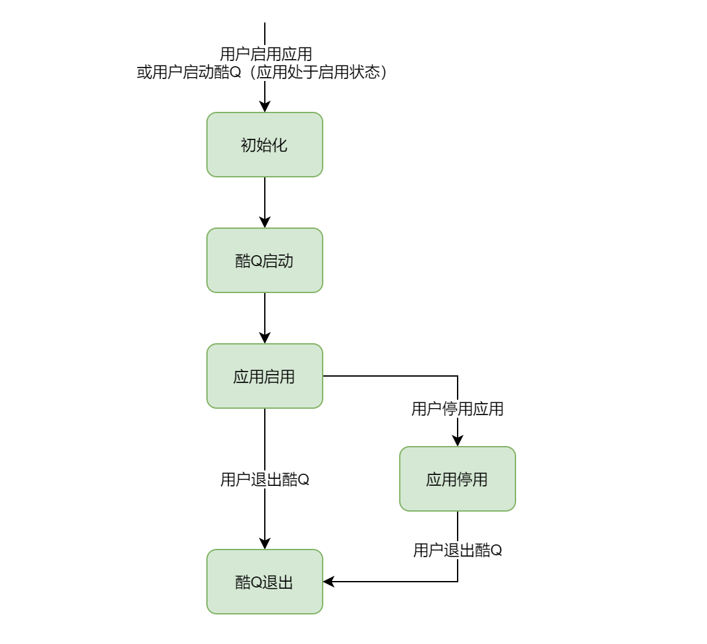

# 生命周期事件

生命周期事件是指与 酷Q 和 酷Q 应用的启动和退出相关的事件。这类事件的处理函数注册方式和普通事件基本一致，区别在于处理函数不需要接受参数。

## 注册事件处理函数

这里以应用启用事件为例（其它生命周期事件的 `on_*` 函数可以和普通事件一样在 `core/event_callback.h` 中找到）：

```cpp
on_enable([] {
    logging::info("启用", "XX群管已启用");
});
```

## 应用生命周期


